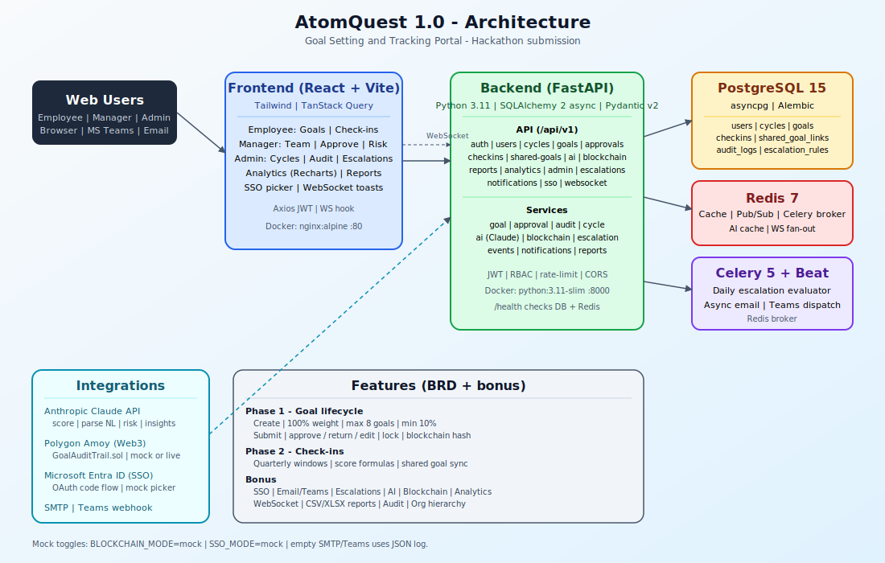

# AtomQuest 1.0 : Goal Setting & Tracking Portal

[](https://fastapi.tiangolo.com/)
[](https://react.dev/)
[](https://www.typescriptlang.org/)
[](https://www.docker.com/)

Full-stack **goal setting and quarterly tracking** web portal built for the **AtomQuest 1.0** hackathon (AtomBerg). It covers **Phase 1 & 2 must-haves**, **Phase 3 roles**, **Phase 4 reporting & governance**, **Section 5 bonus features**, plus three product pillars: **AI-assisted goals**, **blockchain-backed audit trail**, and **real-time updates**.

**Author / contributor:** [@Prachi01Yadav](https://github.com/Prachi01Yadav) 

> **Clone:** After you create the GitHub repository (see [Publishing to GitHub](#publishing-to-github)), replace the URL below with your repo URL.
>
> ```bash
> git clone https://github.com/Prachi01Yadav/atomberg_portal.git
> cd atomberg_portal
> ```

---

## Table of contents

1. [Overview](#overview)
2. [Architecture](#architecture)
3. [Technology stack](#technology-stack)
4. [Feature matrix (BRD + bonuses)](#feature-matrix-brd--bonuses)
5. [Implementation map](#implementation-map)
6. [Business rules](#business-rules-enforced-server-side)
7. [Getting started](#getting-started)
8. [Environment variables](#environment-variables)
9. [Demo accounts](#demo-accounts)
10. [Judge / presentation pack](#judge--presentation-pack)
11. [API documentation](#api-documentation)
12. [Security](#security)
13. [Cost & deployment notes](#cost--deployment-notes)
14. [Publishing to GitHub](#publishing-to-github)
15. [License](#license)

---

## Overview

Organizations often track goals in spreadsheets and email. This portal gives a **single place** for employees to define weighted goals, for **managers (L1)** to approve or return them, for **quarterly check-ins** with computed tracking scores, and for **admin/HR** to configure cycles, view completion analytics, manage users, and audit post-lock changes. Optional integrations add **Microsoft Entra SSO**, **email & Teams notifications**, **rule-based escalations**, and **Claude-powered** quality scoring and risk hints.

---

## Architecture

High-level diagram (SVG):



If the preview above does not load in your viewer, open the file directly: [docs/architecture.svg](docs/architecture.svg).

**Runtime components (Docker Compose)**

| Service | Role |
|--------|------|
| `postgres` | Primary database (PostgreSQL 15) |
| `redis` | Cache, pub/sub for WebSockets fan-out, Celery broker |
| `backend` | FastAPI + Uvicorn |
| `celery-worker` | Async tasks (notifications) |
| `celery-beat` | Scheduled escalation evaluation + check-in reminders |
| `frontend` | Static SPA served via nginx |

Local development can use **SQLite** instead of Postgres (see `start.ps1` and default `DATABASE_URL`).

---

## Technology stack

| Layer | Choice |
|-------|--------|
| **Frontend** | React 18, Vite, TypeScript (strict), TailwindCSS, TanStack Query, Axios + JWT refresh, Recharts |
| **Backend** | Python 3.11, FastAPI, Pydantic v2, SQLAlchemy 2.0 async, Alembic |
| **Auth** | JWT (python-jose), bcrypt (passlib), role guards |
| **Database** | PostgreSQL 15 (`asyncpg`) in Docker; SQLite (`aiosqlite`) for local demos |
| **Realtime** | FastAPI WebSockets + Redis pub/sub |
| **Jobs** | Celery 5 + Redis; Beat schedules escalations and quarter-open reminders |
| **AI** | Anthropic SDK (`claude-sonnet-4`), Redis-cached responses, graceful mock fallback |
| **Blockchain** | SHA-256 goal hashing; Polygon Amoy via Web3-style flow in **live** mode; **mock** file-backed ledger for demos |
| **Integrations** | FastAPI-Mail (SMTP), Microsoft Teams incoming webhook (MessageCard + OpenUri), Azure Entra OAuth + MS Graph (live SSO) |

---

## Feature matrix (BRD + bonuses)

### Phase 1 — Goal creation & approval

| Requirement | Implementation summary |
|-------------|-------------------------|
| Employee goal sheet (thrust area, title, description, UoM, target, weightage) | `frontend/pages/employee/GoalSheet.tsx`, `GoalForm.tsx`; `POST/PATCH /api/v1/goals` |
| UoM types: numeric min/max, timeline, zero-based | `UoMType` enum; scoring in `goal_service.compute_checkin_score` |
| Total weightage = 100%, min 10% per goal, max 8 goals | `goal_service.validate_goals_for_submission`; Pydantic `GoalCreate`; UI `WeightageValidator` + server validation panel |
| Manager approve / return / inline edit | `approval_service.py`, `ApprovalView.tsx`, `POST .../approve`, `.../return`, edit-and-approve flow |
| Lock on approval; admin unlock | Status `locked`; `POST /api/v1/admin/goals/{id}/unlock`; picker `GET /admin/goals/locked` |
| Shared goals (push KPI; recipients edit weightage only; sync actuals) | `shared_goal_service.py`, `SharedGoalsPush.tsx`, linked check-ins |

### Phase 2 — Check-ins & schedule

| Requirement | Implementation summary |
|-------------|-------------------------|
| Quarterly actuals vs planned, status per goal | `CheckinPage.tsx`, `ManagerCheckinView.tsx`, `checkins` API |
| Manager structured feedback | Manager comment on check-in rows + chips |
| Score formulas (tracking only) | Documented in UI (`FormulaLegend`); logic in `goal_service.py` |
| Quarter windows from cycle dates (UTC) | `cycle_service.py`; `GET /checkins/window` |
| Admin force-open window | Query flag `force_open`; checkbox for admin on check-in page |

### Phase 3 — Roles

| Role | Capabilities (high level) |
|------|-------------------------|
| **Employee** | CRUD drafts, submit sheet, check-ins on locked goals, dashboards |
| **Manager** | Team summary, approvals, check-ins, shared push, AI risk panel |
| **Admin** | Cycles, users (CRUD), audit log, escalations, notifications log, analytics, reports, goal unlock |

### Phase 4 — Reporting & governance

| Deliverable | Implementation |
|-------------|----------------|
| Achievement export CSV / Excel | `GET /api/v1/reports/achievement`; openpyxl styling |
| Completion dashboard | `GET /api/v1/reports/completion-dashboard` |
| Employee check-in drill-down matrix | `GET /api/v1/reports/employee-checkin-matrix`; Admin dashboard table |
| Audit trail post-lock | `audit_service.py`; Admin audit UI + blockchain verify |

### Section 5 — Good-to-have (bonuses)

| Feature | Notes |
|---------|--------|
| **Microsoft Entra ID** | Mock SSO picker + `POST /sso/callback`; live path exchanges code, calls Graph `/me`, `/me/manager`, `/me/memberOf`, optional group→role mapping (`azure_*_group_id`). `GET /api/v1/sso/config` for diagnostics. |
| **Email & Teams** | `notification_service.py`; mock writes JSONL; live SMTP / webhook. Goal-specific deep links via `APP_BASE_URL`. |
| **Escalations** | DB rules; Celery daily run + `POST /escalations/run`; admin log + resolve |
| **Quarter-open reminders** | `reminder_service.py` + Beat + `POST /reminders/checkins/run` |
| **Analytics** | QoQ trends, goal distribution, completion heatmap, **manager effectiveness** (`GET /analytics/manager-effectiveness`) |

### Product differentiators

| Area | What it does |
|------|----------------|
| **AI** | Score goal quality, parse natural language to fields, team risk analysis, check-in insights (`app/services/ai_service.py`, `api/v1/ai.py`) |
| **Blockchain** | Hash on approve / audit events; verify endpoint + UI badge (`blockchain_service.py`, `BlockchainBadge.tsx`) |
| **Realtime** | WS events for submit/approve/check-in/escalation (`websocket_manager`, `NotificationToast`, dashboard refresh) |

---

## Implementation map

### Backend (`backend/app/`)

| Path | Responsibility |
|------|----------------|
| `main.py` | App factory, CORS, lifespan, router mounting, `/health` |
| `core/` | Settings, async DB engine/sessions, JWT/passwords, Redis, WebSocket manager |
| `models/` | Users, cycles, goals, check-ins, audit, escalations, shared links |
| `schemas/` | Pydantic request/response models |
| `api/v1/` | Routers: `auth`, `users`, `cycles`, `goals`, `approvals`, `checkins`, `shared_goals`, `reports`, `analytics`, `admin`, `escalations`, `notifications`, `sso`, `system`, `ai`, `blockchain`, `websocket`, `reminders` |
| `services/goal_service.py` | Validation, scoring formulas |
| `services/approval_service.py` | Approve/return/inline edit, re-approval audit |
| `services/audit_service.py` | Post-lock change records + chain hash |
| `services/ai_service.py` | Claude calls + Redis cache + fallbacks |
| `services/blockchain_service.py` | Mock file ledger or live chain writes |
| `services/notification_service.py` | Email, Teams, deep links |
| `services/escalation_service.py` | Rule evaluation |
| `services/reminder_service.py` | Quarter-open check-in emails |
| `services/azure_ad_service.py` | Live SSO token exchange + Graph profile sync |
| `services/report_service.py` | CSV/XLSX, dashboards, heatmap, employee matrix |
| `tasks/` | Celery app, escalation beat, notification tasks, reminder tasks |
| `contracts/` | Solidity source + `abi.json` |
| `seed.py` | Idempotent demo users, cycle, sample goals |

### Frontend (`frontend/src/`)

| Area | Files |
|------|--------|
| Routing / layout | `App.tsx`, `components/AppLayout.tsx` (sidebar, role nav, **System mode** badges) |
| Auth | `lib/auth.tsx`, `lib/api.ts`, `Login.tsx`, `SSOMock.tsx` |
| Realtime | `lib/websocket.ts`, `NotificationToast.tsx` |
| Employee | `employee/GoalSheet.tsx`, `GoalForm.tsx`, `CheckinPage.tsx`, `EmployeeDashboard.tsx` |
| Manager | `manager/TeamDashboard.tsx`, `ApprovalView.tsx`, `ManagerCheckinView.tsx`, `RiskPanel.tsx`, `SharedGoalsPush.tsx` |
| Admin | `admin/*` (dashboard, cycles, users, audit, escalations, notifications) |
| Cross-role | `AnalyticsPage.tsx`, `ReportsPage.tsx` |
| Utilities | `WeightageValidator.tsx`, `BlockchainBadge.tsx`, `formatApiError.ts` |

---

## Business rules (enforced server-side)

- Weighted goals for one employee in one cycle sum to **100%** (±0.01).
- Each goal weight **≥ 10%**, **≤ 8** goals per cycle.
- Only **draft** goals are submitted in bulk; submission runs full validation.
- **Locked** goals cannot be edited except via **admin unlock** (audited).
- **Shared** copies: only **weightage** editable by recipient.
- Check-ins respect **quarter window** unless `force_open` or admin UI override.
- Scores are computed per UoM; weighted rollup uses latest quarter with data (see report/analytics code paths).

---

## Getting started

### Option A — Docker (recommended for judges)

```bash
cp .env.example .env
# Edit .env if needed (secrets, CORS, modes)
docker compose up --build
```

- Frontend: http://localhost  
- Backend: http://localhost:8000  
- Swagger: http://localhost:8000/docs  
- Health: http://localhost:8000/health  

### Option B — Windows local (SQLite + Vite)

From repo root:

```powershell
.\start.ps1
```

Typical ports: API **8000**, UI **5173** or **5174** (see terminal output). Align `CORS_ORIGINS` and `APP_BASE_URL` with your Vite port.

---

## Environment variables

Copy `.env.example` to `.env`. Important groups:

| Group | Purpose |
|-------|---------|
| `SECRET_KEY`, JWT | Signing tokens |
| `DATABASE_URL` | Postgres (Docker) or SQLite (local) |
| `REDIS_URL`, Celery URLs | Cache, broker, WebSocket pub/sub |
| `ANTHROPIC_API_KEY` | Empty → AI **mock**; set → **live** Claude |
| `BLOCKCHAIN_MODE`, Polygon vars | `mock` vs live Amoy |
| `SSO_MODE`, `AZURE_*` | Mock picker vs Entra code flow + Graph sync |
| Mail / `TEAMS_WEBHOOK_URL` | Empty → logged notifications only |
| `APP_BASE_URL` | Links in email/Teams cards |
| `CORS_ORIGINS` | Must include your frontend origin |

Never commit `.env` — it is listed in `.gitignore`.

---

## Demo accounts

| Role | Email | Password |
|------|-------|----------|
| Admin | admin@demo.com | Admin@123 |
| Manager | manager1@demo.com | Mgr@123 |
| Manager | manager2@demo.com | Mgr@123 |
| Employee | emp1@demo.com … emp4@demo.com | Emp@123 |

SSO mock: login screen → **Microsoft Entra ID** → picker page.

---

## Judge / presentation pack

| Asset | Use |
|-------|-----|
| [`docs/demo-judge-slide.html`](./docs/demo-judge-slide.html) | Fullscreen cheat sheet (URLs, credentials, mock vs live script) |
| [`scripts/demo-prep.ps1`](./scripts/demo-prep.ps1) | Removes stray **draft** goals for demo employees so submit stays valid |
| Login page | Expand **For judges** — shows integration modes from `/api/v1/system/info` |
| Sidebar | **System mode**: amber = mock, green = live |

---

## API documentation

Interactive OpenAPI: **`GET /docs`** on the running backend.

Notable public endpoint: **`GET /api/v1/system/info`** — returns `ai_mode`, `blockchain_mode`, `sso_mode`, `email_mode`, `teams_mode` for demos.

**Note:** Visiting only `http://localhost:8000/` returns `{"detail":"Not Found"}` — there is no root HTML route by design. Use `/docs` or `/health`.

---

## Security

- JWT access + refresh; passwords hashed with bcrypt.
- Role-based dependencies on protected routes.
- Employees scoped to own data; managers to direct reports; admin global where intended.
- Pydantic validation on inputs; indexed FK-heavy queries for goals/check-ins.
- Secrets only via environment variables.

---

## Cost & deployment notes

- **Mock modes** avoid billable APIs during development (AI, chain, mail, Teams).
- **Redis TTL** on AI responses reduces duplicate Claude calls.
- **SQLite** keeps laptop demos lightweight; **Postgres** in Compose matches production.
- For cloud hosting: split frontend (static host) + API (container platform) + managed Postgres + Redis; set `CORS_ORIGINS` and `APP_BASE_URL` to public URLs.

---

## Publishing to GitHub

This repository is authored and maintained solely by **[Prachi01Yadav](https://github.com/Prachi01Yadav)** (no co-authors).

1. On GitHub: **New repository** (e.g. `atomquest-goal-portal`), **empty**, no README (you already have one here).
2. On your machine (from the **`atomquest`** folder that contains this README):

```bash
git init
git add .
git commit -m "Initial commit: AtomQuest Goal Portal (hackathon submission)"
git branch -M main
git remote add origin https://github.com/Prachi01Yadav/<your-repo-name>.git
git push -u origin main
```

Or with [GitHub CLI](https://cli.github.com/) (`gh auth login` first):

```bash
gh repo create Prachi01Yadav/<your-repo-name> --public --source=. --remote=origin --push
```

3. Update the clone URL at the top of this README to match your final repo name.

**Before pushing:** confirm `git status` does **not** list `.env`, `venv/`, `node_modules/`, or local `.db` files.

---

## License

This project is submitted as part of **AtomQuest Hackathon 1.0**. Unless stated otherwise by the author, code may be reused with attribution to the repository and hackathon context.

---

**Repository:** [@Prachi01Yadav](https://github.com/Prachi01Yadav) · **Product name:** AtomBerg / AtomQuest Goal Portal
